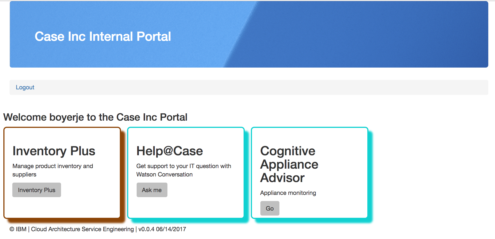

# Case Inc Portal App
This project is part of the 'IBM Integration Reference Architecture' suite, available at [https://github.com/ibm-cloud-architecture/refarch-integration](https://github.com/ibm-cloud-architecture/refarch-integration) and implements the 'cloud native' web application developed with Nodejs and Expressjs to access on-premise inventory database. It should be considered as an internal portal application for CASE Inc internal staff. This application illustrates how to plug and play different Angular 2 components with different back ends of IBM Cloud reference architecture.
For example to demonstrate only the hybrid solution as presented in the [architecture center hybrid](https://www.ibm.com/devops/method/content/architecture/hybridArchitecture) the portal application uses the 'Inventory Plus' feature set, for Cognitive architecture, and specially [Watson Conversation](https://www.ibm.com/devops/method/content/architecture/cognitiveConversationDomain2#1_1) integration, the Portal offers a IT support chat bot.
The current top level view of the home page of this application looks like:
  

The application is up and running at the following address: [not yet available]()

## Pre-requisites
The pre-requisites for the integration solution are defined [here](https://github.com/ibm-cloud-architecture/refarch-integration#prerequisites), so be sure to get them done.
* For this application you need to have [nodejs](https://nodejs.org/en/) installed on your computer with the [npm](https://www.npmjs.com/) installer tool.

* Clone current repository, or if you want to work on the code, fork it in your own github repository and then clone your forked repository on your local computer. If you used the *fork-repos.sh* script of the [Integration solution] you are already set.

```
git clone https://github.com/ibm-cloud-architecture/refarch-caseinc-app
cd refarch-caseinc-app
npm install
```
* You need to install Angular 2 command line interface if you do not have it yet: [cli.angular.io](http://cli.angular.io) tool

 ```
 sudo  npm install -g @angular/cli
 ```
 on Mac for example.
* You need to install [nodemon](https://nodemon.io/) with
```
sudo npm install -g nodemon
```

## Run the application locally
To avoid sharing Bluemix service credential an env.json file needs to be defined within the folder server/routes. A template is delivered for that. So just renaming the template file 'env-tmpl.json' to env.json will make the app running locally without any other settings.

To start the application using node monitoring use the command:
```
npm run dev
```
To run in non-development mode
```
npm start
```

The trace should display a message like below with the url to use
```
[1] starting `node server/server server/server`
[1] Server v0.0.2 starting on http://localhost:6004
```

Point your web browser to the url: [http://localhost:6004](http://localhost:6004) to get access to the user interface of the home page.

The demonstration script is described in this [note](docs/demoflow.md)

## Code explanation
Most of the interactions the user is doing on the Browser are supported by [Angular 2](http://angular.io) javascript library, with its Router mechanism and the DOM rendering capabilities via directives and components. When there is a need to access data to the on-premise server for persistence, an AJAX calls is done to the Secure Gateway URL, and  the server will respond asynchronously later on. The components involved are presented in the figure below in a generic way


### Angular app
The application code is under the client folder, and follows the standard best practice for Angular 2 development:
* unique index.html to support single page application
* use of modules to organize features
* use of component, html and css per feature page

For the inventory the component in client/app/inventory folder use a service to call the nodejs / expressjs REST services.
```javascript
export class InventoryService {
  private invUrl ='/api/i';

  constructor(private http: Http) {
  };

  getItems(): Observable<any>{
    return this.http.get(this.invUrl+'/items')
         .map((res:Response) => res.json())
  }
}
```

### Server code
The application is using nodejs and expressjs standard code structure. The inventory API is defined in the server/routes/feature folder and use request library to perform the call to the Secure Gateway public API combined with the Inventory API secure gateway.

```javascript
router.get('/items', function(req,res){
  console.log("In inventory get all the items from the exposed api");
  request.get(
      {url:'https://cap-sg-prd-5.integration.ibmcloud.com:16582/csplab/sb/sample-inventory-api/items',
      timeout: 10000,
      headers: {
        'x-ibm-client-id': '1dc939dd-c8dc-4d7e-af38-04f9afb78f60',
        'accept': 'application/json',
        'content-type': 'application/json'
        }
      },
      function (error, response, body) {
          if (!error && response.statusCode == 200) {
              console.log(body);
              res.status(200).send(body);
          }
          if (error) {
            console.log(error);
            res.status(500).send([{"id":1,"name":"item1"},{"id":2,"name":"item2"}]);
          }

          // error report empty array
      }
     );

});

```

## Adding other features
The portal application includes a simple chat bot integration to ask IT support related questions by using Watson Conversation. The approach is detailed in [cognitive compute conversation code](https://github.com/ibm-cloud-architecture/refarch-cognitive-conversation-broker). In the context of this application to enable this capability you need to do the following:
* Add a new Watson conversation service in your Bluemix space.
* Modify the Manifest.yml file under this project folder to reference the newly created service with the two lines like:
```
  services:
  - ITSupportConversation
```
* Add the credential for conversation service in the env.json file, something like:
```
"conversation" :{
  "version":"2017-02-03",
  "username":"291xxxx",
  "password":"aDFxxx",
  "workspaceId":"1a3bxxxxx1",
  "conversationId":"ITSupportConversation"
},
```
* Enable the user interface to present the feature access by seeting the mode to orange in env.json
```
    "mode" : "orange"
```
For the conversation demo script please refers to this [node](https://github.com/ibm-cloud-architecture/refarch-cognitive-conversation-broker/blob/master/doc/demoflow.md)

## Upload to Bluemix
To avoid conflict with existing deployed application you need to modify the Manifest.yml file with a new host name.
'''
  host: yourcaseincapp
'''

Use the set of Bluemix CLI command to upload the application:
```
cf login api.ng.bluemix.net
cf push
```

This should create a new cloud foundry application in your bluemix space as illustrated by the following screen copy.  

