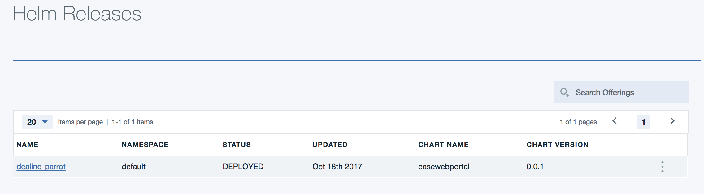

# Run 'Case Web Portal' on IBM Cloud Private
We propose to package this nodejs webapp as a docker image, build a helm chart and then publish it to an ICP instance.

Updated 10/21/2107
## Table of contents
* [Prerequisites](#prerequisites)
* [Build](#build)
* [Deploy to ICP](#push-docker-image-to-icp-private-docker-repository)

## Prerequisites
See this [list](https://github.com/ibm-cloud-architecture/refarch-integration/blob/master/docs/icp/icp-deploy.md#prerequisites) for ICP prerequisites.

We assume the cluster name is: **mycluster.icp** and a namespace was created with the name **brown**.

## Build
As seen in the section [Deploy the CaseInc Portal App in Bluemix Kubernetes Service](https://github.com/ibm-cloud-architecture/refarch-caseinc-app#deploy-the-caseinc-portal-app-in-bluemix-kubernetes-service), this project includes a docker file to build a docker image. You can build the image to your local repository using the command:
```
# first build the App
$ npm run build
$ docker build -t case/webportal .
$ docker images
```
Then tag your local image with the name of the remote ICP server where the docker registry resides. (`mycluster.icp:8500` is the remote server)
```
$ docker tag case/webportal mycluster.icp:8500/brown/casewebportal:v0.0.1
$ docker images
```
An image with the scope namespace is only accessible from within the namespace that it was pushed to.

## Push docker image to ICP private docker repository

If you have copied the ICP master host certificate / public key to the /etc/docker/certs.d/<hostname>:<portnumber> folder on you local computer, you should be able to login to remote docker engine. (If not see this section: [Access ICP docker](https://github.com/ibm-cloud-architecture/refarch-integration/blob/master/docs/icp-deploy.md#access-to-icp-private-repository)) Use a user known by ICP.
```
docker login mycluster.icp:8500
User: admin
Password:
```
Push the image
```
docker push mycluster.icp:8500/brown/casewebportal:v0.0.1
```
More informations could be found [here](https://www.ibm.com/developerworks/community/blogs/fe25b4ef-ea6a-4d86-a629-6f87ccf4649e/entry/Working_with_the_local_docker_registry_from_Spectrum_Conductor_for_Containers?lang=en)

## Build the helm package
Helm is a package manager to deploy application and service to Kubernetes cluster. Package definitions are charts which are yaml files to be shareable between teams.

The first time you need to build a chart for the web app.  Select a chart name (casewebportal) and then use the command:
```
cd chart
helm init casewebportal
```

This creates yaml files and simple set of folders. Those files play a role to define the configuration and package for kubernetes. Under the templates folder the yaml files use parameters coming from helm, the values.yaml and chart.yaml.

The deployment.yaml defines the kubernetes deployment

* The template files may need to be modified to tune for your deployment* For example the following was added for out case.
```
dnsPolicy: ClusterFirst
securityContext: {}
imagePullSecrets:
  - name: admin.registrykey
  - name: default-token-45n44
```

### Chart.yaml
Set the version and name attributes, as they will be used in deployment.yaml. Each time you deploy a new version of your app you can just change the version number. The values in the chart.yaml are used in the templates.

### Add configMap templates
The config.json is a file that can be used when deploying on bluemix or locally, but when running on container within kubernetes it is good practice to externalize application configuration in config map. To do so we need to create a new template **templates/configmap.yaml**. This file uses the same structure as the config.json file but externalizes to get the parameter values from the values.yaml so developer can changes only one file to control the configuration.

```yaml
apiVersion: v1
kind: ConfigMap
metadata:
  name: {{ template "fullname" . }}
  labels:
    chart: "{{ .Chart.Name }}-{{ .Chart.Version | replace "+" "_" }}"
data:
  config.json: |+
    {
        "secureGateway" :{
          "url":"{{ .Values.config.secureGateway.url }}"
        },
        "apiGateway" :{
          "hostUrl": "{{ .Values.config.apiGateway.hostUrl }}",
          "url": "{{ .Values.config.apiGateway.url }}",
          "xibmclientid": "{{ .Values.config.apiGateway.clientid }}"
        },
        "conversationBroker" :{
          "url":"{{ .Values.config.conversationBroker.url }}"
        },
        "mode" : "{{ .Values.config.mode }}",
        "environment" : "{{ .Values.config.environment }}",
        "port": "{{ .Values.config.port }}",
        "version": "{{ .Values.config.version }}"
    }

```

### Modify deployment.yaml
The configuration file can be overloaded by using the create content from the k8s config map. To do so we need to define a Volume to mount to the config.json file in the deployment.yaml as the following:
```yaml
volumeMounts:
- name: config
  mountPath: /caseportal/server/config.json
  subPath: config.json
```
the path */caseportal* comes from the dockerfile, working directory declaration. The volume name (config) is arbitrary but needs to match a volume declared in the deployment.yaml. For example the volume is declared as **config** and use a configMap named using the template name of the helm package. See the paragraph above for the configmap.

```yaml      
volumes:
      - name: config
        configMap:
          name:  {{ template "fullname" . }}
```

### values.yaml
Specify in this file the docker image name and tag
```yaml
image:
  repository: mycluster.icp:8500/brown/casewebportal
  tag: v0.0.1
  pullPolicy: IfNotPresent
```

Try to align the number of helm package with docker image tag.

## Build the application package with helm
```
$ cd chart
$ helm lint casewebportal
# if you do not have issue ...
$ helm package casewebportal
```
These commands should create a zip file with the content of the casewebportal folder. You will use the zip file if you want to get the package visible inside the Catalog.

## Deploy the helm package
There are multiple ways to upload the app to ICP using helm. We can use a private repository, which is a HTTP server, to upload the package file and then use the repository synchronization in ICP to get the chart visible in Application Center, or we can use the `helm install` command:

### Use helm commmand
* Use helm install command to install a chart archive directly to kubernetes cluster
```
$ helm install casewebportal --name casewebportal --namespace brown

NAME:   casewebportal
LAST DEPLOYED: Wed Oct 18 16:08:24 2017
NAMESPACE: default
STATUS: DEPLOYED

RESOURCES:
==> v1/ConfigMap
NAME                          DATA  AGE
casewebportal-casewebportal  1     1s

==> v1/Service
NAME                          CLUSTER-IP  EXTERNAL-IP  PORT(S)   AGE
casewebportal-casewebportal  10.0.0.83   <none>       6100/TCP  1s

==> v1beta1/Deployment
NAME                          DESIRED  CURRENT  UP-TO-DATE  AVAILABLE  AGE
casewebportal-casewebportal  1        1        1           1          1s


NOTES:
1. Get the application URL by running these commands:
  export POD_NAME=$(kubectl get pods --namespace brown -l "app=casewebportal-casewebportal" -o jsonpath="{.items[0].metadata.name}")
  echo "Visit http://127.0.0.1:8080 to use your application"
  kubectl port-forward $POD_NAME 8080:6100 --namespace brown
```

From the above we can see that a deployment was created in kubernetes, the `casewebportal` container runs on one pod and a service got created to expose the deployment on the node at the cluster IP and port 6100. And the NOTES section tells us how to access the pod from our local machine from port 8080. Connection made on the localhost port 8080 are forwarded to port 6100 of the pod. This is one way to test the application.

You can login to ICP console and look at the Workloads > Helm Releases


### Use helm upgrade
We can upgrade an existing running application. You can use the ICP admin console to get the name of the deployed helm release. or use the helm CLI.

```
$ helm list
> NAME           	REVISION	UPDATED                 	STATUS  	CHART              	NAMESPACE
default-iib    	1       	Sat Sep  9 08:41:55 2017	DEPLOYED	iib-0.1.2          	default  
casewebportal  	1       	Thu Sep 14 13:17:39 2017	DEPLOYED	casewebportal-0.0.1	default  

* build a new docker image, tag it with a new version

* upgrade a release with a new version
helm upgrade casewebportal	 ./casewebportal
```

### Verify the app is deployed
```
helm ls --all casewebportal-casewebportal

# remove the app
helm del --purge casewebportal-casewebportal
```
