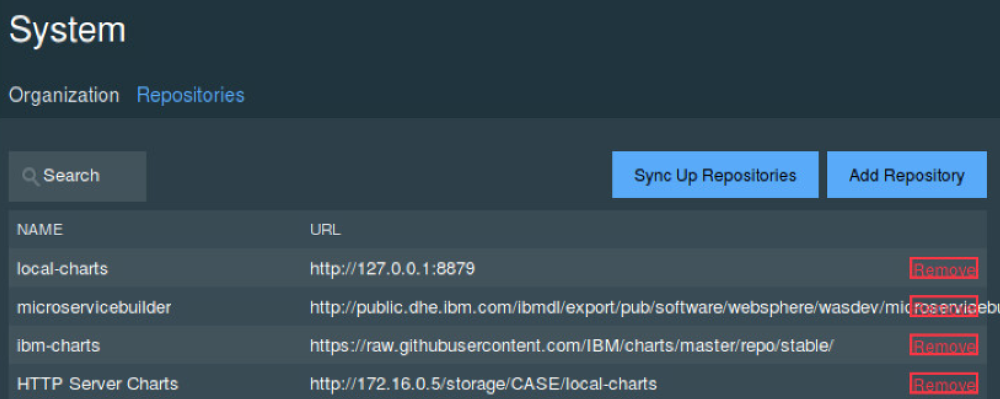

# Run 'Case Web Portal' on IBM Cloud Private
We propose to package this nodejs webapp as a docker image, build a helm chart and then publish it to an ICP instance.

Updated 10/18/2107

## Prerequisites
See this general [list](https://github.com/ibm-cloud-architecture/refarch-integration/blob/master/docs/icp/icp-deploy.md#prerequisites)

We assume in the following commands that the cluster name is: **mycluster.icp** and a namespace was created with the name **brown**.

## Build
As seen in the section [Deploy the CaseInc Portal App in Bluemix Kubernetes Service](https://github.com/ibm-cloud-architecture/refarch-caseinc-app#deploy-the-caseinc-portal-app-in-bluemix-kubernetes-service), this project includes a docker file to build a docker image. You can build the image to your local repository using the command:
```
# first build the App
$ npm run build
$ docker build -t case/webportal .
$ docker images
```
Then tag your local image with the name of the remote ICP server where the docker registry resides, and the namespace to use. (*mycluster.icp:8500* is the remote server and *brown* is the namespace)
```
$ docker tag case/webportal mycluster.icp:8500/brown/casewebportal:v0.0.1
$ docker images
```
An image with the scope namespace is only accessible from within the namespace that it was pushed to.

## Push docker image to ICP private docker repository

If you have copied the ICP master host certificate / public key to the /etc/docker/certs.d/<hostname>:<portnumber> folder on you local computer, you should be able to login to remote docker engine. (If not see this section: [Access ICP docker](https://github.com/ibm-cloud-architecture/refarch-integration/blob/master/docs/icp-deploy.md#access-to-icp-private-repository)) Use a user known by ICP.
```
docker login mycluster.icp:8500
User: admin
Password:
```
Push the image
```
docker push mycluster.icp:8500/brown/casewebportal:v0.0.1
```
More informations could be found [here](https://www.ibm.com/developerworks/community/blogs/fe25b4ef-ea6a-4d86-a629-6f87ccf4649e/entry/Working_with_the_local_docker_registry_from_Spectrum_Conductor_for_Containers?lang=en)

## Build the helm package
Helm is a package manager to deploy application and service to Kubernetes cluster. Package definitions are charts which are yaml files to be shareable between teams.

The first time you need to build a chart for the web app.  Select a chart name (casewebportal) and then use the command:
```
cd chart
helm init casewebportal
```

This creates yaml files and simple set of folders. Those files play a role to define the configuration and package for kubernetes. Under the templates folder the yaml files use parameters coming from helm, the values.yaml and chart.yaml.

The deployment.yaml defines the kubernetes deployment

* The template files may need to be modified to tune for your deployment* For example the following was added for out case.
```
dnsPolicy: ClusterFirst
securityContext: {}
imagePullSecrets:
  - name: admin.registrykey
  - name: default-token-45n44
```

### Chart.yaml
Set the version and name it will be use in deployment.yaml. Each time you deploy a new version of your app you can just change the version number. The values in the char.yaml are used in the templates.

### values.yaml
Specify in this file the docker image name and tag
```yaml
image:
  repository: mycluster.icp:8500/brown/casewebportal
  tag: v0.0.1
  pullPolicy: IfNotPresent
```

Try to align the number of helm package with docker image tag.

## Build the application package with helm
```
$ cd chart
$ helm lint casewebportal
# if you do not have issue ...
$ helm package casewebportal
```
These commands should create a zip file with the content of the casewebportal folder.

## Deploy the helm package
There are multiple ways to upload the app to ICP using helm. We can use a private repository, which is a HTTP server, to upload the package file and then use the repository synchronization in ICP to get the chart visible in Application Center, or we can use the `helm install` command:

### Use helm commmand
* Use helm install command to install a chart archive directly to kubernetes cluster
```
$ helm install casewebportal

NAME:   dealing-parrot
LAST DEPLOYED: Wed Oct 18 16:08:24 2017
NAMESPACE: default
STATUS: DEPLOYED

RESOURCES:
==> v1/ConfigMap
NAME                          DATA  AGE
dealing-parrot-casewebportal  1     1s

==> v1/Service
NAME                          CLUSTER-IP  EXTERNAL-IP  PORT(S)   AGE
dealing-parrot-casewebportal  10.0.0.83   <none>       6100/TCP  1s

==> v1beta1/Deployment
NAME                          DESIRED  CURRENT  UP-TO-DATE  AVAILABLE  AGE
dealing-parrot-casewebportal  1        1        1           0          1s


NOTES:
1. Get the application URL by running these commands:
  export POD_NAME=$(kubectl get pods --namespace default -l "app=dealing-parrot-casewebportal" -o jsonpath="{.items[0].metadata.name}")
  echo "Visit http://127.0.0.1:8080 to use your application"
  kubectl port-forward $POD_NAME 8080:6100
```

From the above we can see that a deployment was created in kubernetes, the casewebportal runs on one pod and a service got created to expose the deployment on the cluster IP on port 6100. And the NOTES section tells us how to access the pod from our local machine.

You can login to ICP console and look at the Workloads > Helm Releases


### Use helm repository
The steps look like:
* copy the tfgz file to the repository. (9.19.34.117 is a HTTP server running in our data center)
```
$ scp casewebportal-0.0.1.tgz boyerje@9.19.34.117:/storage/CASE/refarch-privatecloud
```
* If you want to have you to update your private catalog, you need to modify the index.yaml file.  The index file describe how your applications is listed in the ICP Application Center:
```
$ wget http://172.16.0.5/storage/CASE/local-charts/index.yaml
$ helm repo index --merge index.yaml --url http://9.19.34.117:/storage/CASE/refarch-privatecloud ./
$ scp index.yaml boyerje@172.16.0.5/storage/CASE/local-charts
```
The 172.16.0.5 is a HTTP server which hosts the local-charts repository. You can see its references in the System menu


Once the repository are synchronized your helm chart should be in the catalog:


### Use helm upgrade
Get the helm release list

```
helm list
> NAME           	REVISION	UPDATED                 	STATUS  	CHART              	NAMESPACE
default-iib    	1       	Sat Sep  9 08:41:55 2017	DEPLOYED	iib-0.1.2          	default  
joyous-dragon  	1       	Thu Sep 14 13:17:39 2017	DEPLOYED	casewebportal-0.0.1	default  
ungaged-ladybug	1       	Fri Oct  6 16:07:58 2017	DEPLOYED	casewebportal-0.0.2	default  

# upgrade a release with a new version
helm upgrade ungaged-ladybug	 ./casewebportal
```

### Verify the app is deployed
```
helm ls --all default-casewebportal

# remove the app
helm del --purge default-casewebportal
```
